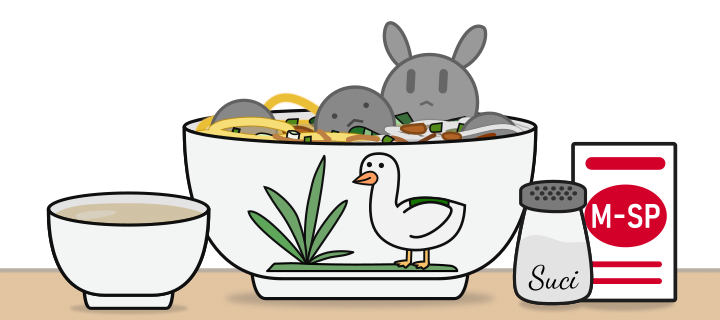

# Resep Bakso Simulator

<p align="center" style="text-align:center"></p>


[](https://estehbunny.github.io/resep-bakso-simulator)

Repositori ini dibuat untuk menampilkan resep dan bahan bakso yang diperlukan dalam game Bakso Simulator. Laman yang dibuat dari repositori ini ditujukan untuk mendukung pengelolaan usaha Bakso dalam game Bakso Simulator dengan menampilkan informasi-informasi berupa:

- Resep bakso
- Harga bahan bakso (baik paket dan satuan)
- Harga bahan baku untuk satuan resep
- Harga resep bakso
- Lokasi pembelian resep bakso dan bahan bakso

## Daftar Bahan & Resep Bakso

> **CATATAN**: daftar bahan & resep bakso berikut ditujukkan untuk game **Bakso Simulator versi terbaru: v0.7**

### Daftar Bahan

Bahan Utama:

| Bahan         | Isi paket | Harga (Steam) | Harga (Mobile) | Beli Instan | Lokasi Pembelian |
| ------------- | :-------: | ------------: | -------------: | ----------: | :--------------: |
| Bakso         | 25        |       Lp22500 |        Lp30000 |     Lp45000 | Supermarket      |
| Bumbu Masak   | 25        |       Lp11250 |        Lp15000 |     Lp18000 | Supermarket      |
| Sayur-sayuran | 25        |       Lp13125 |        Lp17500 |     Lp25000 | Supermarket      |
| Cabe          | 25        |       Lp15000 |        Lp20000 |     Lp28000 | Supermarket      |
| Mie dan Bihun | 25        |       Lp11250 |        Lp15000 |     Lp21000 | Supermarket      |

Bahan Tambahan:

| Bahan   | Isi paket | Harga (Steam) | Harga (Steam) | Lokasi Pembelian   |
| ------- | :-------: | ------------: | ------------: | :----------------: |
| Tahu    | 25        |       Lp26250 |       Lp35000 | Toko Bahan Makanan |
| Micin   | 25        |       Lp10000 |       Lp10000 | Toko Rahasia       |


### Daftar Resep Bakso

#### Info Resep Bakso

| Nama             | Bakso | Cabe  | Sayur | Mie & Bihun | Bumbu | Harga Jual |
| ---------------- | :---: | :---: | :-----: | :---------: | :---: | ---------: |
| Bakso Original   | 2 | 1 | 1 | 1 | 1 |   Lp20000 |
| Bakso Pedas      | 2 | 4 | 1 | 1 | 4 |   Lp55000 |
| Bakso Bakso      | 6 | 0 | 0 | 0 | 0 |   Lp42500 |
| Bakso Vegetarian | 0 | 2 | 6 | 1 | 2 |   Lp45000 |
| Mie Bakso        | 1 | 2 | 2 | 5 | 2 |   Lp50000 |
| Bakso Mahal      | 6 | 5 | 5 | 5 | 5 |  Lp100000 |

| Nama             | Bakso | Cabe  | Sayur   | Mie & Bihun | Bumbu | Tahu | Harga Jual |
| ---------------- | :---: | :---: | :-----: | :---------: | :---: | :--: | ---------: |
| Bakso Tahu       | 1 | 1 | 1 | 1 | 2 | 5 |  Lp80000 |

#### Harga beli resep

| Nama             | Harga Resep (PC) | Harga Resep (Mobile) | Lokasi Resep |
| ---------------- | ---------: | ----------: | :----------: |
| Bakso Original   |          - | - |-         |
| Bakso Pedas      |  Lp4125000 | Lp5500000 | Les Masak |
| Bakso Bakso      |  Lp3187500 | Lp4250000 | Les Masak |
| Bakso Vegetarian |  Lp3375000 | Lp4500000 | Les Masak |
| Mie Bakso        |  Lp3750000 | Lp5000000 | Les Masak |
| Bakso Mahal      |  Lp8000000 | Lp10000000 | Les Masak |

| Nama             | Harga Resep (PC) | Harga Resep (Mobile) | Lokasi Resep |
| ---------------- |  ---------: | ----------: | :----------: |
| Bakso Tahu       | Lp6000000 | Lp8000000 | Les Masak |


## Cara Penggunaan Situs

### Daftar Versi

> Lho, kenapa resep baksim yang ada di website kamu beda sama yang aku mainkan?


> **Malas baca? _(TLDR)_:** Pilih platform sesuai perangkat yang digunakan dalam bermain Bakso Simulator!

Dikarenakan perilisan *update* Bakso Simulator tidak dirilis secara bersamaan untuk semua platform, maka terdapat pembagian berdasarkan versi/platform yang digunakan dalam resep tersebut agar sesuai dengan rilisan game Bakso Simulator.

Aturan tersebut berlaku apabila Bakso Simulator sudah dirilis terlebih dahulu untuk platform tertentu (misalnya Steam), namun belum tersedia untuk platform lainnya. Untuk menangani masalah tersebut, pengguna dapat memilih platform untuk menampilkan daftar resep sesuai rilisan Bakso Simulator yang tersedia pada platform yang dimainkan.

Hal ini tentunya berlaku apabila terdapat perbedaan antara versi mobile dan PC yang mengharuskan pengguna mobile untuk mendapatkan resep/bahan dengan biaya lebih mahal dibanding pengguna PC atau sebaliknya **_(esTehBunny's hypotesis)_**.

### Bakso Simulator Mobile vs PC

1. **_In-App Purchases_**: hanya tersedia di mobile
2. Biaya untuk pembelian beberapa item **lebih murah di PC** dibanding mobile.
3. Iklan di versi **mobile** untuk mendapatkan item/refill/gacha/saldo gratis & atur waktu.
4. Biaya resep & bahan di PC **lebih murah** dibanding mobile.

### Kartu Bahan


- Nama bahan
- Harga paket bahan
- Isi paket bahan
- Harga satuan bahan
- Lokasi pembelian bahan

### Kartu Resep/Menu Bakso


- Nama bakso
- Bahan resep
- Harga jual bakso
- Harga bahan baku untuk satuan resep *(base price)*
- Harga resep
  - "Tersedia sejak awal game" untuk bakso original
  - "Diperoleh setelah menyelesaikan Quest XYZ" untuk resep bakso yang diperoleh dari quest
- Lokasi untuk menemukan resep (quest/toko resep)


## Catatan Teknis - Data JSON

### Resep/Menu Bakso (`bakso.json`)

```json
{
  "id": "bakso-original",
  "name": "Bakso Original",
  "recipeSource": "-",
  "recipePrice": 0,
  "sellPrice": 15000,
  "recipe": [
    {
      "id": "bakso",
      "amount": 2
    },
    {
      "id": "cabe",
      "amount": 1
    },
    {
      "id": "sayur",
      "amount": 1
    },
    {
      "id": "mie-bihun",
      "amount": 1
    },
    {
      "id": "bumbu",
      "amount": 1
    }
  ]
}
```

Resep (`recipe`) pada bakso didefinisikan sebagai *array*, terbagi atas beberapa bahan yang tersedia untuk semua menu bakso atau menu-menu tertentu saja.

Contoh definisi *array* `recipe` untuk satuan resep bakso adalah sebagai berikut:

```json
[
  {
    "id": "bakso",
    "amount": 2
  },
  {
    "id": "cabe",
    "amount": 1
  },
  {
    "id": "sayur",
    "amount": 1
  },
  {
    "id": "mie-bihun",
    "amount": 1
  },
  {
    "id": "bumbu",
    "amount": 1
  }
]
```

### Bahan pembuatan Bakso (`bahan.json`)

```json
{
  "id": "bakso",
  "name": "Bakso",
  "price": 25000,
  "amount": 25,
  "availability": "Supermarket"
}
```

## Run this repository locally!

Navigate into cloned repository's directory and start it up!

```shell
cd resep-bakso-simulator/
npm start
```

In the project directory, you can run:

1.  `npm start`

    Runs the app in the development mode.\
    Open [http://localhost:3000](http://localhost:3000) to view it in your browser.

    The page will reload when you make changes.\
    You may also see any lint errors in the console.

2.  `npm test` *(coming soon)*

    Launches the test runner in the interactive watch mode.\
    See the section about [running tests](https://facebook.github.io/create-react-app/docs/running-tests) for more information.

3.  `npm run build`

    Builds the app for production to the `build` folder.\
    It correctly bundles React in production mode and optimizes the build for the best performance.

    The build is minified and the filenames include the hashes.\
    Your app is ready to be deployed!

    See the section about [deployment](https://facebook.github.io/create-react-app/docs/deployment) for more information.

## Support Me!

<p align="center" style="text-align:center"></p>

> **🥣🦆🦆📡 So, Bakso!**
>
> Kijang 1 ganti 🦌, Kijang 2 ganti🦌!

**PR/Issues are welcomed here!**

Anda dapat buat **issue** apabila ingin menyampaikan masalah/saran/masukan untuk repository ini, **fork** repository ini untuk improvisasi, dan/atau beri bintang di laman repository ini untuk anda simpan di daftar favorit anda!

**See you :wink:** - EsTehBunny (:ice_cube::tropical_drink::rabbit:)
